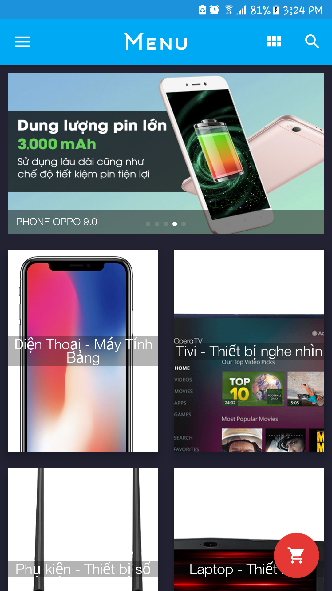

<p align="center">
  <!-- Logo -->
  
</p>

<p align="center">
  <a href="https://www.paypal.me/KenHoangDev">
    
  </a>
</p>

## Introduction

[fg-shop](git@github.com:KenHoang16CDTH12/FGShop-OpenSource.git) is a shop online project. It has 2 platforms which are [php](http://php.net/) and [android](https://developer.android.com/studio/). Use model MVP for Android and MVC for Web PHP

- [Donate](https://www.paypal.me/KenHoangDev)

## Preparation

You need to install [Android Studio](https://developer.android.com/studio/) and [git](https://git-scm.com/) locally. The project is based on web PHP mvc model not used framework and app [android](https://developer.android.com/studio/).
Understanding and learning this knowledge in advance will greatly help the use of this project.

---
## Screenshots WEB

<p align="center">
  
</p>

<p align="center">
  
</p>

<p align="center">
  
</p>

<p align="center">
  
</p>

## Screenshots APP

<p align="center">
        
</p>

## Demo

<a href="http://www.youtube.com/watch?v=7NAP8fK5jrI" target="_blank"></a>

## Features WEB

```
- ADMIN Login
  - Manage user authorization (Add, edit, delete)
  - User management (Add, edit, delete)
  - Manage images (Add, edit, delete)
  - Brand management (Add, edit, delete)
  - Manage product types (Add, edit, delete)
  - Product management (Add, edit, delete)
  - Banner management (Add, edit, delete)
  - Manage orders (Add, edit, delete)
- API
  - Pay data to json (API) for app android to use

```

## Features APP

```
- General function
  - Register / Login
    - Default (username, password)
    - Facebook
    - Google
- Customers are not logged in
  - View products
  - Banner
  - See product details
  - View the number of ratings and favorites.
- Customers have login
  - Includes functions of customers not logged in
  - Comment-Rating
  - Add products to cart
  - ...etc...
```

## Setup

```bash
# clone the project
git clone https://github.com/KenHoang16CDTH12/FGShop-OpenSource.git
```
After downloading, go to the database directory with the FGShop.sql file,
```bash
# Database

1. Create database FGShop

2. Import database FGShop.sql

3. Wait
```
Move the WEB directory to the localhost directory
```bash
# WEB

1. Open folder with sublimetext

2. Edit file Web/FGShop/system/config/config.php (change Config)

3. Edit file Web/FGShop/admin.php (change URL)

4. Edit file Web/FGShop/api.php (change URL)

5. Open browser with url 'http://localhost/.../FGShop/admin.php?controller=user&action=login'

6. Account default username: admin & password: 123456
```
Import project on Android Studio
```bash
# ANDROID

1. Go to Common.java

2. Edit SEVER_NAME.

```

## Donate

If you find this project useful, you can buy author a glass of juice :tropical_drink:

[Paypal Me](https://www.paypal.me/KenHoangDev)

## License

[MIT](#)

Copyright (c) 2018-present FGDev
